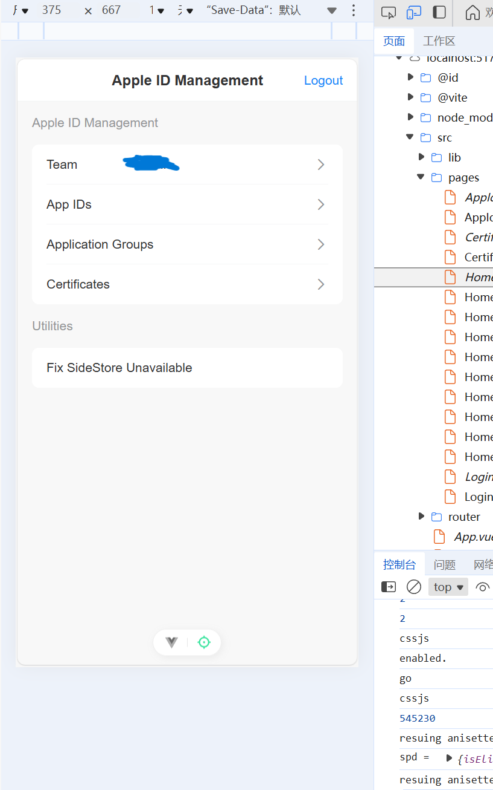

# DeveloperSession.js
A pure JavaScript (Vue) frontend project that lets you sign in to your free Apple Developer account and manage your App ID (download provisioning profiles and manage entitlements), App Groups, certificates, and more directly from a web browser, provided that CORS restrictions are not enforced.

Demo:
<div align="center">
   
</div>
# Develop

```shell
npm run dev
```
During development, we use Nginx as a reverse proxy to handle all requests and bypass CORS restrictions in the browser.

See `nginx.conf` for the Nginx configuration and `.env.development` for the host settings used in development.

# Build

```shell
npm run build
```
In production, real hosts (e.g. `https://gsa.apple.com`) are used. Make sure your production environment does not enforce CORS restrictions. One way to achieve this is by replacing the `window.XMLHttpRequest` object (used by Axios) with a custom implementation you provide.

# Credits
Inspired by https://github.com/thxmxx/FindMy.js

Most of the frontend code was generated by AI.

Some API-related code was translated from Rust to JavaScript by AI. Original Rust implementation: https://github.com/nab138/isideload